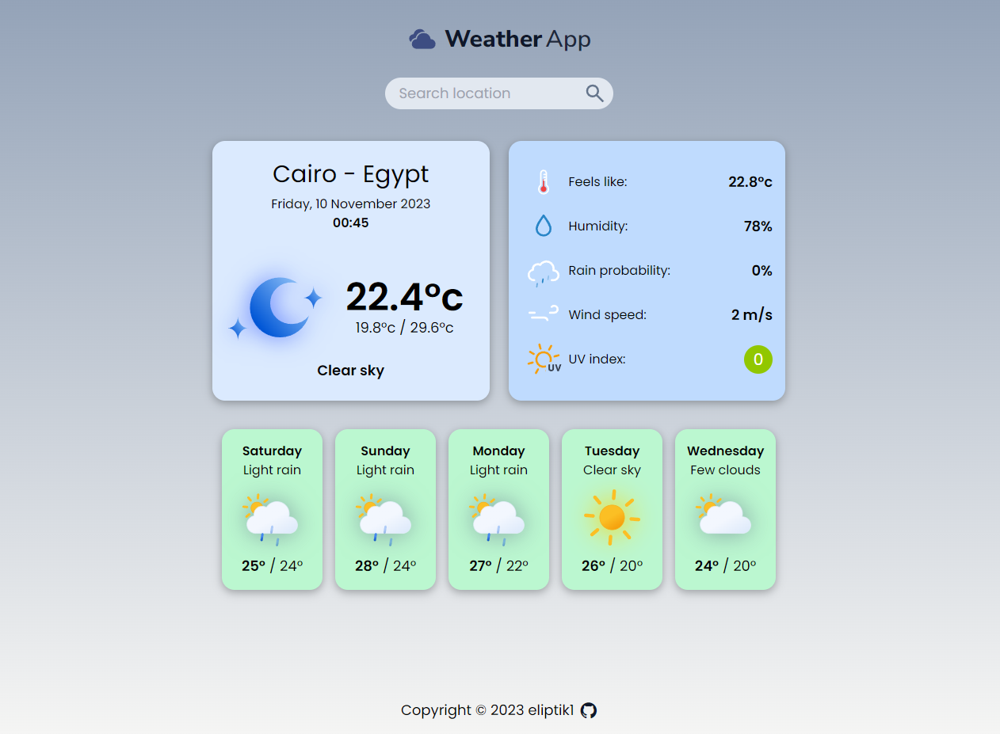

# Weather App

This is a user-friendly Weather App offering instant and accurate weather updates for any location. Powered by OpenWeatherMap API.

## Technologies Used

- HTML
- CSS
- Tailwind
- JavaScript (ES6 modules)
- Webpack
- Date-fns library
- Git

## Features

- **Current Weather:** Get the current temperature, weather condition, humidity, wind speed, and more.
- **Forecast:** View a detailed weather forecast for the next 5 days, including temperature highs and lows.
- **Search:** Easily find the weather for any location by searching for city names or using coordinates.
- **Full Responsiveness:** A seamless experience across various screen sizes, ensuring it's accessible on desktops, tablets, and mobile devices.

## Demo

Check out the live demo: [Weather-App Demo](https://eliptik1.github.io/weather-app/)

## Screenshots

## License

This project is open-source and available under the MIT License.